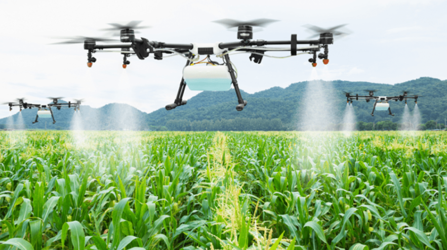

# Farmer Drone
Drone capable of flying over crop fields to control livestock, observe the quality of the land and activate irrigation areas.

# Table of Contents

* [What is this?](#1)
   * [Requeriments](#R)
   * [Description](#2)
   * [Hardware Scheme](#3)
   * [Software Architecture](#4)
      * [3D Point Cloud tomato detection](#5)
        * [HSI Threshold Color](#HSI)
        * [PassThrough Filter](#P)
        * [Clustering and RANSAC](#CR)
      * [Inverse kinematics algorithm](#6)
      * [Movement](#M)
   * [Simulation](#7)
   * [Testing and results](#8)
   * [3D Pieces](#9)
   * [Amazing contributions](#10)   
   * [Video](#11)
   * [Authors](#12)

# What is this? 
The main objective of Farmer Drone is to maintain an exhaustive control over farmland and livestock by means of the use of a drone that will be able to fly at low altitude to control the livestock and observe the quality of the terrain.

# Requeriments 
For running each sample code:

- Python 3.7
- numpy
- math
- matplotlib
- cv2
- sympy
- time

# Description 

The main objective of Farmer Drone is to maintain exhaustive control over farmland and pasture through the use of a drone that will be able to fly at low altitude to control livestock and observe the quality of the land.

As for livestock monitoring, the drone will be equipped with counting and location technology, allowing farmers to have a complete and accurate view of the number and location of their animals at all times. This will help farmers ensure the health and safety of their livestock, reduce the risk of theft and improve the overall performance of their business.

In addition to monitoring livestock, the drone will also be equipped with sensors to detect soil moisture. This information will allow farmers to activate irrigated areas efficiently, which will allow them to reduce water use and improve the quality of the land.

The drone's design will also allow for easy integration with existing farm management systems, allowing for easy data collection and analysis. Armed with this information, farmers will be able to make more informed decisions about their crops and increase the efficiency of their operations.

In summary, the robotics project we are developing aims to improve the efficiency of agriculture and reduce environmental impact through the use of advanced technology. We hope this specialized drone will help farmers improve the health of their livestock, the quality of their land, and increase the overall yield of their crops.

# Hardware Component List 
This is the hardware scheme made for our drone. 
 

# Software Architecture 
In order to develop the software part of Matt-Omato, we have divided the development into two parts. 

In the diagram below you can see there are 4 main modules:
- Irrigation Module: Using the information received from the module that processes the information on the state of the land, it will decide whether to activate the irrigation, in case the land is not wet enough, or deactivate them in the event that the land is receiving too much water. The order will be sent to the risks by means of a signal (a priori by radio).
- Ground Status Module: The state of the farmland will be detected and controlled by means of an infrared camera and computer vision, this will send the results of the processing to the modules that need them for their operation.
- Animal Monitoring Module: This module will be in charge of monitoring and controlling the animals within the territory of a farm, that is, it will control that they remain within the limits of the territory and state of the animal through its heat.
- Nutrients/Pesticides Module: The module will take care of dropping nutrients or pesticides depending on the use case needed. If a poor state of the land is detected or with certain deficiencies in it, nutrients will be applied to favor the growth of crops in specific areas. Likewise, there will be an option to launch pesticides on the crops that are considered convenient.

## Animal and Ground Status Detection 
 
 In order to provide Matt-Omato with computer vision, it has been necessary to integrate an RGB-D camera that provides depth and color information. Thanks to this we are able to create the 3D point cloud of the scene.
 
In order to obtain the coordinates of the tomatoes at the end of the computer vision algorithm, the following steps have been followed to facilitate our work on the 3D point cloud and tomato detection.
 
 ### HSI Threshold 
  

At this stage we pass the RGB values obtained by the camera to the HSI color space which is more similar to human vision and easier to parameterize. Once we have the point cloud in this color space, we have defined a threshold which will allow us to keep only those points we are interested in. In this case with tomato colors such as medium ripe green, orange about to ripen and deep red representing a ripe tomato. These are the colors that we accept that Matt-Omato harvests.
 
  ### PassThrough Filter 
At this stage the total number of points within the 3D cloud is reduced. The idea is to define a bounding box that limits us to a range in which to keep only those points that fall inside. In this way we will only keep the tomatoes that are close to the camera and remove those background points that the camera can detect. This will make the execution time very small.
  
  ### Clustering and RANSAC 
  
In order to detect all tomatoes in the scene individually, it is necessary to develop an algorithm capable of separating all the groups of points. That is why we have used a clustering algorithm which allows us to group the points by groups establishing the minimum amount of points that we want to have to form one. In this way we also avoid possible noise that may have crept in from the previous stages.

Finally, in order to obtain the coordinates of the tomatoes, we have used a RANSAC algorithm to adjust the points of each cluster to the sphere shape defined by RANSAC. Using the "pyRansac3D" library we are able to obtain the centers of these spheres and therefore the centers of the tomatoes.

## Drone Movement 

In order to be able to move Matt-Omato autonomously, he has been provided with two distance sensors capable of detecting any element in front of or behind him. 

Matt-Omato starts his movement in a straight line thanks to the rails and cannot deviate from them. The steps that Matt-Omato follows internally for the movement are as follows:
1. Does the depth sensor detect any elements in front of it?
2. If it detects any element
   - Rotate camera joint to point to the other line of tomato plants
3. If no element is detected
   - Runs computer vision algorithm
   - If detects a tomato
      - Performs inverse kinematics
      - Takes the tomato and place it in the box
   - If does not detect tomato
      - Moves in the indicated direction for one second
      - Back to point 1

# Simulation 
In order to test Matt-Omato it has been necessary to use the CoppeliaSim software where we have the whole robot recreated in real size with all the hardware components and all the software components (Python). We have a total of 10 scenes where the difficulty increases according to the number of tomato plants, the number of tomatoes in each tomato plant, the size of the tomatoes and the color of the tomatoes.

# Testing and results 
To verify how good the proposed solution is, each of the created scenes has been run several times to check the accuracy of the XYZ coordinates of the tomatoes calculated by the computer vision algorithm and the coordinates of the tomatoes in CoppeliaSim. The results can be seen in the following table:

| Escena | Cows | Pigs | Wet terrain |   Dry terrain | Error Medio Total |
|--------|------|------|-------------|---------------|-------------------|
|      1 |   4  |   4  |     0,10431 |     0,0260775 |           0,05327 |
|      2 |   8  |   4  |    0,330662 |    0,04133275 |        0,06844625 |
|      3 |   7  |   4  |      0,2093 |        0,0299 |            0,0546 |
|      4 |   8  |   4  |      0,3357 |     0,0419625 |         0,1457675 |
|      5 |   1  |   4  |  0,52457715 | 0,04035208846 |      0,0742254435 |
|      6 |  12  |   4  |  0,40989956 | 0,03415829667 |     0,06782020461 |
|      7 |   8  |   4  |  0,30705157 | 0,03838144625 |     0,07164351548 |
|      8 |  26  |   4  |     0,92196 |       0,03546 |     0,06114258958 |
|      9 |  36  |   4  |     1,32336 |       0,03676 |     0,06590490678 |
|     10 |  16  |   4  |      0,5264 |        0,0329 |      0,0544548951 |

# 3D Pieces 
The following parts have been designed using TinkerCad software, the files can be found in the "Piezas 3D" folder.

| | | | |
|:-------------------------:|:-------------------------:|:-------------------------:|:-------------------------:|
|  Hélices |   Arm 1| Arm 2 |  Wrist |
|  Robot base |   Wheels | Box |  Gripper finger |
| Wheel support |   Camera support| Proximity sensor|

# Amazing contributions 
We think that our project is unique for several reasons, among them we have the following points:
  
1. Livestock Tracking and Counting Technology: The use of advanced technology to monitor livestock in crop fields is relatively new.
2. Integration with farm management systems: Designing the drone to easily integrate with existing farm management systems can be very useful for farmers.
3. Soil Moisture Sensor: The drone's ability to detect soil moisture would help farmers optimize their water use and increase the efficiency of their operations.
4. Adaptability and customization: The construction of an adaptable and customizable drone according to the specific needs of farmers and different types of crops.
5. Reduced environmental impact: Drone designed to reduce environmental impact compared to other traditional monitoring and irrigation methods, which can be valuable to farmers and the environment.

# Video 

# Authors 
- Víctor Hernández Garrido - 1597028 - <a href="https://github.com/1597028">Github</a>
- Marc Serra Ruíz - 1603957 - <a href="https://github.com/1603957">Github</a>
- Adrián Nieto Núñez - 1569312 - <a href="https://github.com/adrian-nieto">Github</a>
- Joel Sánchez de Murga Pacheco - 1598948 - <a href="https://github.com/1598948">Github</a>
