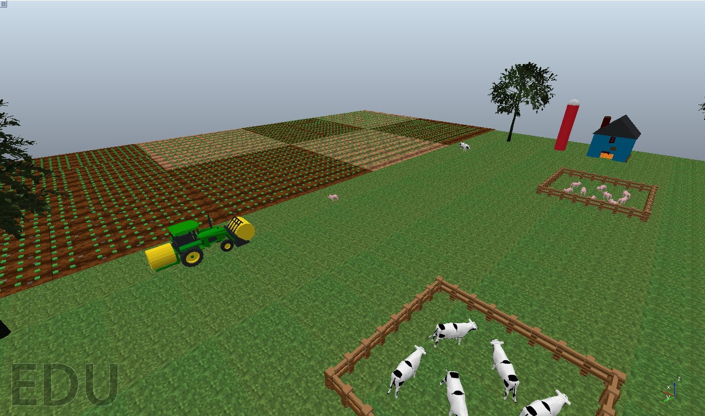
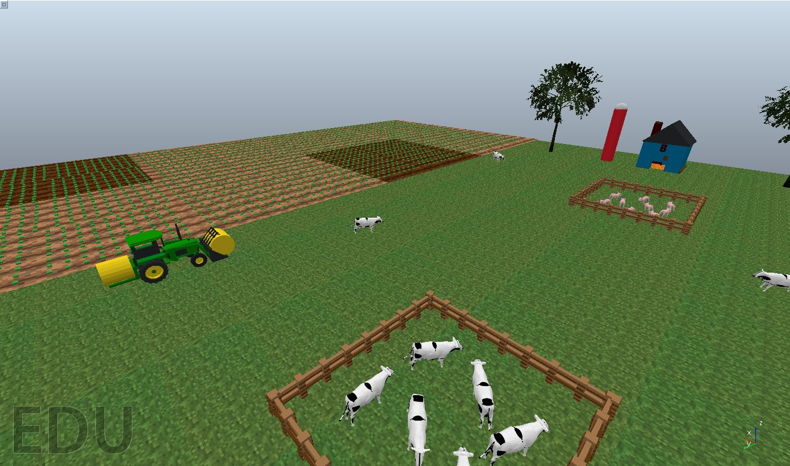
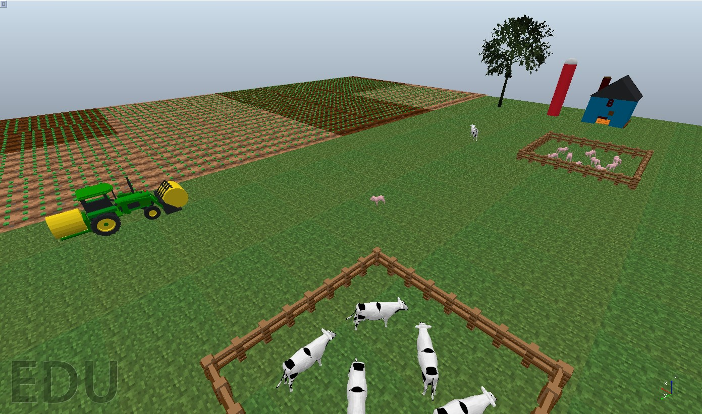
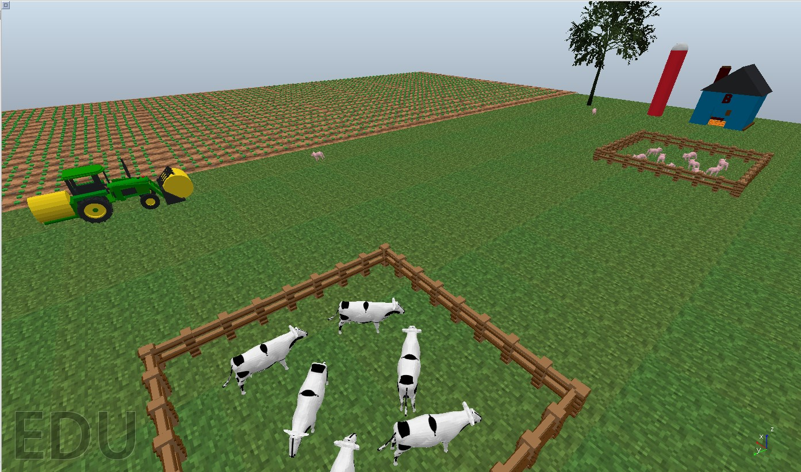
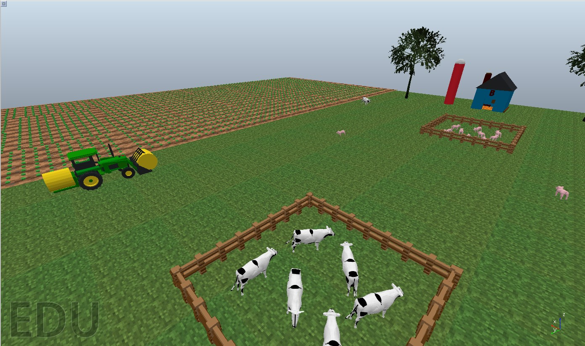
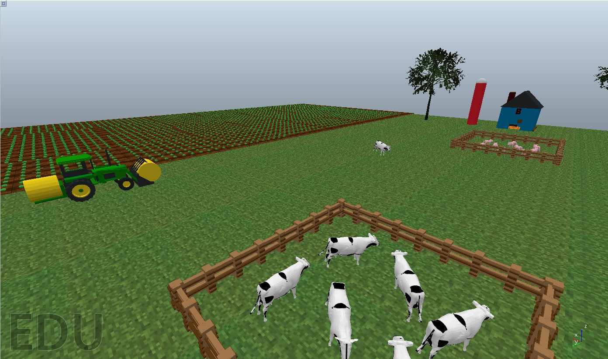

# Farmer Drone
Drone capable of flying over crop fields to control livestock, observe the quality of the land and activate irrigation areas.

# Table of Contents

* [What is this?](#1)
   * [Requeriments](#R)
   * [Description](#2)
   * [Hardware Components List](#3)
   * [Software Architecture](#4)
      * [Animal and Ground Status Detection](#5)
        * [Scene background](#SB)
        * [Apply HSV Filter](#HSV)
        * [Binary Image](#BI)
      * [Drone Movement](#DM)
   * [Simulation](#7)
   * [Testing and results](#8)
   * [3D Pieces](#9)
   * [Amazing contributions](#10)   
   * [Video](#11)
   * [Authors](#12)

# What is this? 
The main objective of Farmer Drone is to maintain an exhaustive control over farmland and livestock by means of the use of a drone that will be able to fly at low altitude to control the livestock and observe the quality of the terrain.

# Requeriments 
For running each sample code:

- Python 3.7
- numpy
- math
- matplotlib
- cv2
- sympy
- time

# Description 

The main objective of Farmer Drone is to maintain exhaustive control over farmland and pasture through the use of a drone that will be able to fly at low altitude to control livestock and observe the quality of the land.

As for livestock monitoring, the drone will be equipped with counting and location technology, allowing farmers to have a complete and accurate view of the number and location of their animals at all times. This will help farmers ensure the health and safety of their livestock, reduce the risk of theft and improve the overall performance of their business.

In addition to monitoring livestock, the drone will also be equipped with sensors to detect soil moisture. This information will allow farmers to activate irrigated areas efficiently, which will allow them to reduce water use and improve the quality of the land.

The drone's design will also allow for easy integration with existing farm management systems, allowing for easy data collection and analysis. Armed with this information, farmers will be able to make more informed decisions about their crops and increase the efficiency of their operations.

In summary, the robotics project we are developing aims to improve the efficiency of agriculture and reduce environmental impact through the use of advanced technology. We hope this specialized drone will help farmers improve the health of their livestock, the quality of their land, and increase the overall yield of their crops.

# Hardware Component List 
This is the hardware scheme made for our drone. 
 
| Component                   | Units | Price/Unit | Budget |
|-----------------------------|-------|------------|--------|
| Motor DC 12V 100RPM         | 4     | 2,64       | 10,56  |
| Batería LiPo 5000mAh        | 2     | 11,90      | 23,80  |
| Cámara autofocus 12MP       | 1     | 35,29      | 35,29  |
| Cámara térmica AMG8833      | 1     | 65,98      | 65,98  |
| SparkFun 9DoF IMU Breakout  | 1     | 6,25       | 6,25   |
| Placa controladora de vuelo | 1     | -          | -      |
| Receptor RF 434Mhz          | 1     | 36,32      | 36,32  |
| Emisor RF 434Mhz            | 1     | 35,32      | 36,32  |
| ESP32 STEAMakers            | 1     | 30,95      | 30,95  |
| **Total**                   |       |            | 245,47 |
 

# Software Architecture 
In order to develop the software part of Farmer Drone, we have divided the development into two parts. 

In the diagram below you can see there are 4 main modules:
- Irrigation Module: Using the information received from the module that processes the information on the state of the land, it will decide whether to activate the irrigation, in case the land is not wet enough, or deactivate them in the event that the land is receiving too much water. The order will be sent to the risks by means of a signal (a priori by radio).
- Ground Status Module: The state of the farmland will be detected and controlled by means of an infrared camera and computer vision, this will send the results of the processing to the modules that need them for their operation.
- Animal Monitoring Module: This module will be in charge of monitoring and controlling the animals within the territory of a farm, that is, it will control that they remain within the limits of the territory and state of the animal through its heat.
- Nutrients/Pesticides Module: The module will take care of dropping nutrients or pesticides depending on the use case needed. If a poor state of the land is detected or with certain deficiencies in it, nutrients will be applied to favor the growth of crops in specific areas. Likewise, there will be an option to launch pesticides on the crops that are considered convenient.

## Animal and Ground Status Detection 

To enhance the capabilities of the Farmer Drone, we have integrated an RGB-D camera that provides depth and color information, enabling advanced computer vision techniques. 
By leveraging the power of computer vision algorithms and the RGB-D camera, the Farmer Drone is able to detect and monitor animals and other objects on the ground. This feature greatly enhances the overall monitoring and management of farmland, enabling farmers to gather real-time information and take appropriate actions as needed.

The RGB-D camera captures both depth and color information, allowing for accurate detection and localization of objects within the scene. This information can be used to monitor the health and behavior of livestock, assess the quality of the terrain, and identify potential issues such as crop damage or pest infestations.

The integration of advanced computer vision techniques and the RGB-D camera represents a significant advancement in precision agriculture. It empowers farmers with valuable insights and actionable data, enabling them to optimize their operations, make informed decisions, and ultimately enhance the productivity and sustainability of their farming practices.

 ### Scene Background 
In this stage of the project, the RGB values obtained by the camera are transformed into the HSI (Hue, Saturation, and Intensity) color space. The HSI color space is chosen for its similarity to human vision and ease of parameterization. By converting the RGB values to HSI, we can perform further analysis and processing on the scene.

We define a threshold to filter and retain only the points of interest. This thresholding process allows us to focus on specific objects or features in the scene. In the context of the Farmer Drone project, this step helps us identify and analyze relevant information related to the ground and the environment.

By leveraging the HSI color space and applying appropriate thresholds, we can extract valuable insights about the ground status, such as soil quality, vegetation health, and potential areas of concern. This information assists farmers in making informed decisions regarding irrigation, fertilization, and pest control, ultimately optimizing their farming practices and improving crop yield.

The utilization of the HSI color space and thresholding techniques contributes to the overall effectiveness of the Farmer Drone project by providing valuable data and analysis that can enhance farm management and decision-making processes.
 
  ### Apply HSV Filter 
In this stage, we apply an HSV (Hue, Saturation, Value) filter. The objective is to reduce the total number of points and focus on a specific range of colors that we are interested in. By defining a bounding box, we can limit the points to those that fall within this range.

The purpose of applying the HSV filter is to remove background points that may be detected by the camera, allowing us to isolate and keep only the points of interest. By doing so, we can optimize the execution time and improve the efficiency of the processing algorithm.

This filtering step is crucial in the Farmer Drone project as it helps in identifying and retaining important elements within the scene, such as objects on the ground or specific features related to the environment. By focusing on a particular color range, we can extract meaningful information that assists in analyzing the terrain, monitoring livestock, or detecting potential areas of concern.

Overall, the application of the HSV filter enhances the accuracy and performance of the Farmer Drone system, ensuring that only relevant points are considered for further analysis and decision-making processes.
  
  ### Binary Image 
To identify and separate different objects or groups of interest in the scene, we utilize a clustering algorithm. This algorithm allows us to group points based on their proximity and connectivity, forming distinct clusters. By specifying a minimum threshold for the number of points required to form a cluster, we can filter out noise and ensure that only significant groups are considered.

The clustering algorithm plays a crucial role in the Farmer Drone project as it enables the detection of various objects or elements within the scene. We can identify individual entities or groups, such as livestock, vegetation, or other relevant features present in the farmland.

The output of the clustering algorithm is a binary image, where each pixel corresponds to a specific object or cluster in the scene. This binary image serves as a valuable input for further processing and analysis, allowing us to perform more accurate identification, tracking, or monitoring of the detected elements.

By applying the clustering algorithm and generating a binary image, the Farmer Drone system becomes capable of efficiently separating and categorizing different groups of points, enhancing its overall effectiveness in tasks such as terrain assessment, livestock monitoring, and overall farm management.

  ### Color filter 
In the Farmer Drone project, a color filter is applied to reduce the total number of points and focus on specific areas of interest. The purpose of this stage is to define a bounding box or range of colors that allows us to retain only the points falling within that range. By doing so, we can filter out background points detected by the camera and selectively keep the points corresponding to objects or elements of interest.

By applying a color filter, we can effectively isolate and extract relevant information from the scene. This process helps optimize the execution time of subsequent algorithms and tasks by reducing the amount of data to be processed.

The color filter is a valuable step in the Farmer Drone project as it allows for efficient targeting and analysis of specific objects or areas in the farmland. By eliminating unnecessary points outside the defined range, the drone's computational resources can be utilized more efficiently, leading to faster and more accurate data processing.

Overall, the color filter stage enhances the capabilities of the Farmer Drone system in tasks such as object detection, environmental monitoring, and precision agriculture, contributing to improved farm management and productivity.

## Drone Movement 

Farmer Drone starts its movement in a straight line within the established limits of the farm and cannot deviate from them. The steps that Farmer Drone follows internally for the movement are the following:
1. It travels distance on the X axis
2. If the limit on the X of the farm is detected, the drone rotates.
     - Once the rotation has been carried out, the drone advances to move on the Y axis the distance equivalent to the range that the camera can capture.
3. Once it has finished moving on the Y axis, it makes the inverse path on the X axis to sweep the entire field.
     - Runs computer vision algorithm
     - If you detect a dry crop
        - Send a notification indicating the status.
        - Activate irrigation
     - If it detects a wet crop
        - Send a notification
        - Disable irrigation.
4. If you detect an animal outside your fence:
    - Send a notification
    - Send the coordinates of the drone where the animal was captured.

# Simulation 
In order to test Farmer Drone it has been necessary to use the CoppeliaSim software where we have the entire robot recreated in real size with all the hardware components and all the software components (Python). We have a total of 6 scenarios where different cases are tested to see the behavior of the drone in different situations.

# Tests and results 
To check how good the proposed solution is, each of the created scenes has been run several times to check the precision of the computer vision algorithm on the different scenarios and configurations. The results can be seen in the following table:

| Scene | Wet terrain | Dry terrain | Terrain accuracy |
|-------|-------------|-------------|------------------|
|     1 |           5 |           3 |             100% |
|     2 |           2 |           6 |             100% |
|     3 |           4 |           4 |             100% |
|     4 |           0 |           8 |             100% |
|     5 |           0 |           8 |             100% |
|     6 |           8 |           0 |             100% |

| Scene | Cows total | Cows detected | Pigs total | Pigs detected | Animal detection accuracy |
|-------|------------|---------------|------------|---------------|---------------------------|
|     1 |          2 |             2 |          2 |             1 |                       75% |
|     2 |          4 |             4 |          0 |             0 |                      100% |
|     3 |          1 |             1 |          1 |             0 |                       50% |
|     4 |          0 |             0 |          3 |             1 |                       33% |
|     5 |          2 |             1 |          2 |             2 |                       75% |
|     6 |          2 |             1 |          2 |             1 |                       50% |

The main reason why our computer vision detection algorithm sometimes fails is because the drone's movement is sequential and sometimes it takes pictures of the animals halfway, so they cannot be fully recognized.

# Created 3D Pieces 
The following parts have been designed using TinkerCad software, the files can be found in the "models/drone_parts" folder.
| Body | Propellers | Motor |
|------|------------|-------|
|| | |

# Amazing contributions 
We think that our project is unique for several reasons, among them we have the following points:
  
1. Livestock Tracking and Counting Technology: The use of advanced technology to monitor livestock in crop fields is relatively new.
2. Integration with farm management systems: Designing the drone to easily integrate with existing farm management systems can be very useful for farmers.
3. Soil Moisture Sensor: The drone's ability to detect soil moisture would help farmers optimize their water use and increase the efficiency of their operations.
4. Adaptability and customization: The construction of an adaptable and customizable drone according to the specific needs of farmers and different types of crops.
5. Reduced environmental impact: Drone designed to reduce environmental impact compared to other traditional monitoring and irrigation methods, which can be valuable to farmers and the environment.

# Video 
)

# Authors 
- Víctor Hernández Garrido - 1597028 - <a href="https://github.com/1597028">Github</a>
- Marc Serra Ruíz - 1603957 - <a href="https://github.com/1603957">Github</a>
- Adrián Nieto Núñez - 1569312 - <a href="https://github.com/adrian-nieto">Github</a>
- Joel Sánchez de Murga Pacheco - 1598948 - <a href="https://github.com/1598948">Github</a>
